# Usage

In this page are presented some use examples of the `GSIBerror` class. In these examples, there are considered two differente background error covariances matrices, one provided by the Developmental Testbed Center ([DTC](https://dtcenter.org/)) and another calculated by using pairs of 48 and 24 hours forecasts from the Braziliand Atmospheric Model (BAM) from the Center for Weather Forecasts and Climate Studies (CPTEC)[^1], using the NMC method.

[^1]: Matriz de Covariâncias dos Erros de Previsão Aplicada ao Sistema de Assimilação de Dados Global do CPTEC: Experimentos com Observação Única. Disponível em: [https://www.scielo.br/j/rbmet/a/8LQNdCV9jJM9whJdpkDLfCh/abstract/?lang=pt&format=html](https://www.scielo.br/j/rbmet/a/8LQNdCV9jJM9whJdpkDLfCh/abstract/?lang=pt&format=html).

!!! info "Info"

    A version of this page for the Juptyter Notebook can be fount at [https://github.com/cfbastarz/GSIBerror/blob/main/read_gsi_berror_python-class-final.ipynb](https://github.com/cfbastarz/GSIBerror/blob/main/read_gsi_berror_python-class-final.ipynb).

    If you want to interact with the notebook, click on buttom below to load the Binder.

    [](https://mybinder.org/v2/gh/cfbastarz/GSIBerror/main)

## The `GSIBerror` class

To use the class, load it with the following command:

=== "Command"

    ```python linenums="1"
    from GSIBerror import Berror
    ```

The following python modules are optional and can be loaded in case the user wants to plot the matrix records. The module `cartopy` is loaded to plot the coastlines for the records related to the `sst`(sea surface temperature) only, since the remainder of the records are latitude dependent.

=== "Command"

    ```python linenums="1"
    import os
    import matplotlib.pyplot as plt
    import cartopy.crs as ccrs
    import cartopy.feature as cfeature
    
    %matplotlib inline
    ```

!!! info "Info"

    In the repository, there is a script called [`plot_functions.py`](https://github.com/GAD-DIMNT-CPTEC/GSIBerror/blob/main/plot_functions.py) where are implemented some auxiliary ploting functions to use along with the `GSIBerror` class. See an example of it usage in the notebook [`read_gsi_berror_python-class-final-BCPTEC_hyb_coord-compara-exemplos.ipynb`](https://github.com/GAD-DIMNT-CPTEC/GSIBerror/blob/main/read_gsi_berror_python-class-final-BCPTEC_hyb_coord-compara-exemplos.ipynb). In the notebook, apart from what is being detailed in this page, there are used two matrices with the same number of vertical levels.

## Defining the covariance files

In the following section, it is defined the file to be read. In this example, two matrices are handled at the same time, `fncep` (the DTC matrix) and `fcptec` (the CPTEC matrix). Both matrices have different, which will be further inspected:

=== "Command"

    ```python linenums="1"
    path = '/dados/das/pesq1/BAM.berror/xc50/old/'
    
    bcptec = 'gsir4.berror_stats.gcv.BAM.TQ0062L028'
    bncep = 'global_berror.l64y386.f77-ncep-dtc.gcv'
    
    fncep = os.path.join(path, bncep)
    fcptec = os.path.join(path, bcptec)
    ```

## Using the `GSIBerror` class

To use the class, it is necessary to create instances for each of the matrices to be read:

=== "Command"

    ```python linenums="1"
    ncep_b = Berror(fncep)
    cptec_b = Berror(fcptec)

    ```

## The `read_records` method

The `read_records` method is used to read all of the records (ie., horizontal regression coefficients, vertical and horizontal lenght scales and standard deviations) from the matrices and their attributes (ie., number of latitude, longitude and vertical levels). The documentation of this method can be accessed by using the following command:

=== "Command"

    ```python linenums="1"
    help(Berror.read_records)
    ```
=== "Result"

    ```python linenums="1"
    Help on function read_records in module GSIBerror:
    
    read_records(self)
        read_records
        ------------
        
        This method reads the first three records of the background error covariance matrix (nlat, nlon and nsig).
        These records are used to calculate the size of the remainder records from the matrix. All attributes read from
        the matrix are provided by this function. The plotting of the records are made through the use of the xarray's 'plot()'
        method; depending on the use, it can be necessary to to load the matplotlib and cartopy modules.
        
        Parâmetros de entrada
        ---------------------
            None.

        Result
        ------
            bfile: object created with the records and attributes from the background error covariance matrix (see the list below)
                   
        Available attributes
        --------------------
            file_name         : string with the name of the file
            nlat              : integer with the number of latitude points 
            nlon              : integer with the number of longitude points 
            nsig              : integer with the number of vertical levels
            lats              : nd-array with the latitude values (-90 to 90)
            lons              : nd-array with the longitude values (0 to 360)
            levs              : nd-array with the vertical levels (1 to nsig)
            amplitudes        : dicionary with the xarrays for the control variables amplitudes
            amplitudes_names  : names of the variables in the amplitudes dictionary
            balprojs          : dictionary with xarrays for the regression coefficients matrices for the temperature, 
                                surface pressure and velocity potential
            hscales           : dictionary with xarrays for the horizontal length scales
            hscales_var_names : names of the variables in the hscales dictionary
            vscales           : dictionary with xarrays for the vertical length scales
            vscales_var_names : names of the variables in the vscales dictionary
                    
        Use
        ---
            from GSIBerror import Berror
        
            bfile = Berror('arquivo_matriz_B.gcv')
        
            bfile.read_records()
            
            bfile.nlat, bfile.nlon, bfile.nsig
            
            bfile.amplitudes_names
            
            bfile.amplitudes['sf']
            
            bfile_amp_sf = bfile.amplitudes['sf']
            
            bfile_amp_sf.plot.contourf()    
    ``` 

To read the records and attributes from the matrices through the instances `ncep_b` and `cptec_b`:

=== "Command"

    ```python linenums="1"
    ncep_b.read_records()
    cptec_b.read_records()
    ```

## Checking the matrix attributes

The background error covariance used by GSI has some records that can be checked by through the `GSIBerror` class.

### Matrix dimension

To check the matrices attributes, just use the class instance for the desired matrix with one of the following attribute names:

* `nlat`: number of latitude points;
* `nlon`: number of longitude points;
* `nsig`: number of vertical levels.

=== "Command"

    ```python linenums="1"
    ncep_b.nlat, ncep_b.nlon, ncep_b.nsig
    ```

=== "Result"

    ```python linenums="1"
    (386, 768, 64)
    ```

Doing the same for the `cptec_b` instance:

=== "Command"

    ```python linenums="1"
    cptec_b.nlat, cptec_b.nlon, cptec_b.nsig
    ```

=== "Result"

    ```python linenums="1"
    (98, 192, 28)
    ```

### Horizontal regression coefficients

To check the matrices attributes, just use the class instance for the desired matrix with one of the following attribute names:

* `balprojs`: horizontal regression coefficients;
* `amplitudes`: standard deviations of the GSI control variables;
* `hscales`: horizontal length scales;
* `vscales`: vertical length scales.

=== "Command"

    ```python linenums="1"
    ncep_b.balprojs
    ```

=== "Result"

    ```python linenums="1"
    {'agvin': <xarray.DataArray 'agvin' (sigma: 64, latitude: 386, sigma_2: 64)>
     array([[[ 9.1390668e-39, -1.4570713e-08, -1.4229909e-08, ...,
               1.9885631e-07, -3.0927532e-07, -1.5866360e-07],
             [ 1.9645067e-07,  2.0414565e-07,  2.1749047e-07, ...,
               3.9498239e-08,  2.1559554e-08, -2.6009864e-08],
             [ 1.9645067e-07,  2.0414565e-07,  2.1749047e-07, ...,
               3.9498239e-08,  2.1559554e-08, -2.6009864e-08],
             ...,
             [-4.0456254e-07, -4.1785779e-07, -4.3682641e-07, ...,
               4.0088888e-10, -7.6423277e-08,  3.1785959e-08],
             [-4.0533263e-07, -4.1864789e-07, -4.3763430e-07, ...,
               5.5518179e-10, -7.6580413e-08,  3.1765442e-08],
             [-4.0576197e-07, -4.1908416e-07, -4.3808009e-07, ...,
               6.3978484e-10, -7.6664413e-08,  3.1752339e-08]],
     
            [[-4.0576197e-07, -4.1908416e-07, -4.3808009e-07, ...,
               6.3978484e-10, -7.6664413e-08,  3.1752339e-08],
             [ 1.9722712e-07,  2.0493923e-07,  2.1830989e-07, ...,
               3.6942918e-08,  2.0000796e-08, -2.4325955e-08],
             [ 1.9722712e-07,  2.0493923e-07,  2.1830989e-07, ...,
               3.6942918e-08,  2.0000796e-08, -2.4325955e-08],
     ...
             [-1.4934518e-08, -1.4844422e-08, -1.4163690e-08, ...,
              -2.2026695e-07, -7.9369016e-08,  3.3956766e-07],
             [-1.5031601e-08, -1.4944586e-08, -1.4267745e-08, ...,
              -2.2030216e-07, -7.9460399e-08,  3.3963573e-07],
             [-1.5084682e-08, -1.5000639e-08, -1.4326437e-08, ...,
              -2.2031999e-07, -7.9510286e-08,  3.3967311e-07]],
     
            [[-1.5084682e-08, -1.5000639e-08, -1.4326437e-08, ...,
              -2.2031999e-07, -7.9510286e-08,  3.3967311e-07],
             [ 8.5512752e-09,  8.5789829e-09,  8.2154630e-09, ...,
               2.4457648e-07,  8.1705295e-08, -3.7984395e-07],
             [ 8.5512752e-09,  8.5789829e-09,  8.2154630e-09, ...,
               2.4457648e-07,  8.1705295e-08, -3.7984395e-07],
             ...,
             [-1.4472619e-08, -1.4127865e-08, -1.2758253e-08, ...,
              -3.0925835e-07, -1.5847982e-07,  4.0097532e-07],
             [-1.4536464e-08, -1.4193026e-08, -1.2824126e-08, ...,
              -3.0927063e-07, -1.5859801e-07,  4.0104135e-07],
             [-1.4570713e-08, -1.4229909e-08, -1.2862232e-08, ...,
              -3.0927532e-07, -1.5866360e-07,  4.0107770e-07]]], dtype=float32)
     Coordinates:
       * latitude  (latitude) float64 -90.0 -89.53 -89.06 -88.6 ... 89.06 89.53 90.0
       * sigma     (sigma) int64 1 2 3 4 5 6 7 8 9 10 ... 56 57 58 59 60 61 62 63 64
       * sigma_2   (sigma_2) int64 1 2 3 4 5 6 7 8 9 ... 56 57 58 59 60 61 62 63 64,
     'bgvin': <xarray.DataArray 'bgvin' (sigma: 64, latitude: 386)>
     array([[ 0.31404725,  0.31404725,  0.31410804, ..., -0.3134667 ,
             -0.31346098, -0.31346098],
            [ 0.309024  ,  0.309024  ,  0.30907533, ..., -0.30182734,
             -0.30181533, -0.30181533],
            [ 0.29433075,  0.29433075,  0.29436478, ..., -0.27594185,
             -0.27591783, -0.27591783],
            ...,
            [ 0.02594377,  0.02594377,  0.02594201, ...,  0.06056742,
              0.06057847,  0.06057847],
            [-0.03358313, -0.03358313, -0.03357612, ...,  0.05812103,
              0.0581184 ,  0.0581184 ],
            [-0.04917536, -0.04917536, -0.049166  , ...,  0.05161405,
              0.0516182 ,  0.0516182 ]], dtype=float32)
     Coordinates:
       * latitude  (latitude) float64 -90.0 -89.53 -89.06 -88.6 ... 89.06 89.53 90.0
       * sigma     (sigma) int64 1 2 3 4 5 6 7 8 9 10 ... 56 57 58 59 60 61 62 63 64,
     'wgvin': <xarray.DataArray 'wgvin' (sigma: 64, latitude: 386)>
     array([[-2.0349323e-07, -2.0356120e-07, -2.0368390e-07, ...,
              2.4741092e-07,  2.4741092e-07,  0.0000000e+00],
            [ 0.0000000e+00,  0.0000000e+00,  0.0000000e+00, ...,
              0.0000000e+00,  0.0000000e+00,  0.0000000e+00],
            [ 0.0000000e+00,  0.0000000e+00,  0.0000000e+00, ...,
              0.0000000e+00,  0.0000000e+00,  0.0000000e+00],
            ...,
            [ 0.0000000e+00,  0.0000000e+00,  0.0000000e+00, ...,
              0.0000000e+00,  0.0000000e+00,  0.0000000e+00],
            [ 0.0000000e+00,  0.0000000e+00,  0.0000000e+00, ...,
              0.0000000e+00,  0.0000000e+00,  0.0000000e+00],
            [ 0.0000000e+00,  0.0000000e+00,  0.0000000e+00, ...,
              0.0000000e+00,  0.0000000e+00,  9.1390668e-39]], dtype=float32)
     Coordinates:
       * latitude  (latitude) float64 -90.0 -89.53 -89.06 -88.6 ... 89.06 89.53 90.0
       * sigma     (sigma) int64 1 2 3 4 5 6 7 8 9 10 ... 56 57 58 59 60 61 62 63 64}
    ```

Note that the `balprojs` records are stored in a dictionary with three keys `agvin`, `bgvin` and `wgvin`. These are the horizontal regression coefficients used by GSI to construct the balanced part of the temperature, potential velocity and surface pressure, respectively:

* `agvin`: horizontal regression coefficients for the temperature;
* `bgvin`: horizontal regression coefficients for the velocity potential;
* `wgvin`: horizontal regression coefficients for the surface pressure.

Quoting the GSI manual[^2]:

> Because of the size of the model variables, the full size of a B matrix is extremely large. It is typically on the order of $10^{6} \times 10^{6}$, which in its present form cannot be stored in any computer. This problem is simplified by using an ideal set of analysis variables for which the analysis is performed. These are generally referred to as "analysis control variables". The analysis control variables are selected such that the cross-correlations between these variables are minimum, which means less off-diagonal terms in B. The cross dependency among these analysis control variables is removed. The balance between analysis variables (such as mass and wind fields) are achieved with pre-computed "regression coefficients". Further, the forecast errors are modeled as a Gaussian distribution with pre-computed variances and "lengthscale" parameters for each of the analysis control variables. We will use the following sub-sections to briefly introduce how GSI processes these pre-computed background error statistics and applies them in a GSI analysis.

[^2]: Available at [https://dtcenter.org/community-code/gridpoint-statistical-interpolation-gsi/documentation](https://dtcenter.org/community-code/gridpoint-statistical-interpolation-gsi/documentation).

These records with the horizontal regression coefficients can be accessed in the following way:

=== "Command"

    ```python linenums="1"
    ncep_b.balprojs['agvin']
    ```

=== "Result"

    ```python linenums="1"
    <xarray.DataArray 'agvin' (sigma: 64, latitude: 386, sigma_2: 64)>
    array([[[ 9.1390668e-39, -1.4570713e-08, -1.4229909e-08, ...,
              1.9885631e-07, -3.0927532e-07, -1.5866360e-07],
            [ 1.9645067e-07,  2.0414565e-07,  2.1749047e-07, ...,
              3.9498239e-08,  2.1559554e-08, -2.6009864e-08],
            [ 1.9645067e-07,  2.0414565e-07,  2.1749047e-07, ...,
              3.9498239e-08,  2.1559554e-08, -2.6009864e-08],
            ...,
            [-4.0456254e-07, -4.1785779e-07, -4.3682641e-07, ...,
              4.0088888e-10, -7.6423277e-08,  3.1785959e-08],
            [-4.0533263e-07, -4.1864789e-07, -4.3763430e-07, ...,
              5.5518179e-10, -7.6580413e-08,  3.1765442e-08],
            [-4.0576197e-07, -4.1908416e-07, -4.3808009e-07, ...,
              6.3978484e-10, -7.6664413e-08,  3.1752339e-08]],
    
           [[-4.0576197e-07, -4.1908416e-07, -4.3808009e-07, ...,
              6.3978484e-10, -7.6664413e-08,  3.1752339e-08],
            [ 1.9722712e-07,  2.0493923e-07,  2.1830989e-07, ...,
              3.6942918e-08,  2.0000796e-08, -2.4325955e-08],
            [ 1.9722712e-07,  2.0493923e-07,  2.1830989e-07, ...,
              3.6942918e-08,  2.0000796e-08, -2.4325955e-08],
    ...
            [-1.4934518e-08, -1.4844422e-08, -1.4163690e-08, ...,
             -2.2026695e-07, -7.9369016e-08,  3.3956766e-07],
            [-1.5031601e-08, -1.4944586e-08, -1.4267745e-08, ...,
             -2.2030216e-07, -7.9460399e-08,  3.3963573e-07],
            [-1.5084682e-08, -1.5000639e-08, -1.4326437e-08, ...,
             -2.2031999e-07, -7.9510286e-08,  3.3967311e-07]],
    
           [[-1.5084682e-08, -1.5000639e-08, -1.4326437e-08, ...,
             -2.2031999e-07, -7.9510286e-08,  3.3967311e-07],
            [ 8.5512752e-09,  8.5789829e-09,  8.2154630e-09, ...,
              2.4457648e-07,  8.1705295e-08, -3.7984395e-07],
            [ 8.5512752e-09,  8.5789829e-09,  8.2154630e-09, ...,
              2.4457648e-07,  8.1705295e-08, -3.7984395e-07],
            ...,
            [-1.4472619e-08, -1.4127865e-08, -1.2758253e-08, ...,
             -3.0925835e-07, -1.5847982e-07,  4.0097532e-07],
            [-1.4536464e-08, -1.4193026e-08, -1.2824126e-08, ...,
             -3.0927063e-07, -1.5859801e-07,  4.0104135e-07],
            [-1.4570713e-08, -1.4229909e-08, -1.2862232e-08, ...,
             -3.0927532e-07, -1.5866360e-07,  4.0107770e-07]]], dtype=float32)
    Coordinates:
      * latitude  (latitude) float64 -90.0 -89.53 -89.06 -88.6 ... 89.06 89.53 90.0
      * sigma     (sigma) int64 1 2 3 4 5 6 7 8 9 10 ... 56 57 58 59 60 61 62 63 64
      * sigma_2   (sigma_2) int64 1 2 3 4 5 6 7 8 9 ... 56 57 58 59 60 61 62 63 64
    ```

For the `bgvin`:

=== "Command"

    ```python linenums="1"
    ncep_b.balprojs['bgvin']
    ```

=== "Result"

    ```python linenums="1"
    <xarray.DataArray 'bgvin' (sigma: 64, latitude: 386)>
    array([[ 0.31404725,  0.31404725,  0.31410804, ..., -0.3134667 ,
            -0.31346098, -0.31346098],
           [ 0.309024  ,  0.309024  ,  0.30907533, ..., -0.30182734,
            -0.30181533, -0.30181533],
           [ 0.29433075,  0.29433075,  0.29436478, ..., -0.27594185,
            -0.27591783, -0.27591783],
           ...,
           [ 0.02594377,  0.02594377,  0.02594201, ...,  0.06056742,
             0.06057847,  0.06057847],
           [-0.03358313, -0.03358313, -0.03357612, ...,  0.05812103,
             0.0581184 ,  0.0581184 ],
           [-0.04917536, -0.04917536, -0.049166  , ...,  0.05161405,
             0.0516182 ,  0.0516182 ]], dtype=float32)
    Coordinates:
      * latitude  (latitude) float64 -90.0 -89.53 -89.06 -88.6 ... 89.06 89.53 90.0
      * sigma     (sigma) int64 1 2 3 4 5 6 7 8 9 10 ... 56 57 58 59 60 61 62 63 64
    ```

For the `wgvin`:

=== "Command"

    ```python linenums="1"
    ncep_b.balprojs['wgvin']
    ```
=== "Result"

    ```python linenums="1"
    <xarray.DataArray 'wgvin' (sigma: 64, latitude: 386)>
    array([[-2.0349323e-07, -2.0356120e-07, -2.0368390e-07, ...,
             2.4741092e-07,  2.4741092e-07,  0.0000000e+00],
           [ 0.0000000e+00,  0.0000000e+00,  0.0000000e+00, ...,
             0.0000000e+00,  0.0000000e+00,  0.0000000e+00],
           [ 0.0000000e+00,  0.0000000e+00,  0.0000000e+00, ...,
             0.0000000e+00,  0.0000000e+00,  0.0000000e+00],
           ...,
           [ 0.0000000e+00,  0.0000000e+00,  0.0000000e+00, ...,
             0.0000000e+00,  0.0000000e+00,  0.0000000e+00],
           [ 0.0000000e+00,  0.0000000e+00,  0.0000000e+00, ...,
             0.0000000e+00,  0.0000000e+00,  0.0000000e+00],
           [ 0.0000000e+00,  0.0000000e+00,  0.0000000e+00, ...,
             0.0000000e+00,  0.0000000e+00,  9.1390668e-39]], dtype=float32)
    Coordinates:
      * latitude  (latitude) float64 -90.0 -89.53 -89.06 -88.6 ... 89.06 89.53 90.0
      * sigma     (sigma) int64 1 2 3 4 5 6 7 8 9 10 ... 56 57 58 59 60 61 62 63 64
    ```

To retrieve the min and max values, eg., from the horizontal regression coefficients of the velocity potential (`bgvin`), use either the `min()` or `max()` methods from the `xarray` module:

=== "Command"

    ```python linenums="1"
    ncep_b.balprojs['bgvin'].min()
    ```
=== "Result"

    ```python linenums="1"
    <xarray.DataArray 'bgvin' ()>
    array(-0.33616406, dtype=float32)
    ```

And for `max()`:

=== "Command"

    ```python linenums="1"
    ncep_b.balprojs['bgvin'].max()
    ```

=== "Result"

    ```python linenums="1"
    <xarray.DataArray 'bgvin' ()> 
    array(0.3307993, dtype=float32)
    ```

In a more direct way:

=== "Command"

    ```python linenums="1"
    ncep_b.balprojs['bgvin'].values.min(), ncep_b.balprojs['bgvin'].values.max()
    ```

=== "Result"

    ```python linenums="1"
    (-0.33616406, 0.3307993)
    ```

To plot the horizontal regression coefficients for the velocity potential `bgvin`, just use the `plot()` method from the `xarray` module:

=== "Command"

    ```python linenums="1"
    ncep_b.balprojs['bgvin'].plot()
    ```

=== "Result"

    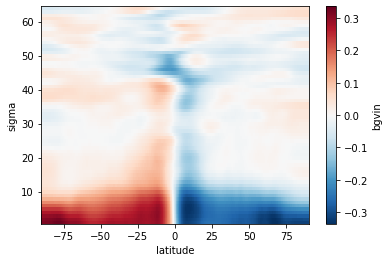
    

For the `cptec_b` instance:

=== "Command"

    ```python linenums="1"
    cptec_b.balprojs['bgvin'].plot()
    ```

=== "Result"

    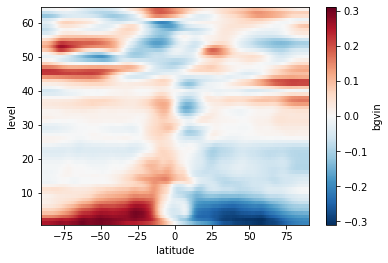
    
To compare the horizontal regression coefficients for the instantiated matrices `ncep_b` and `cptec_b`, see the next examples.

Note that the horizontal regression coefficients for the temperature `agvin` have an extra dimension named `sigma_2`. This extra dimension needs to be set for one of the levels contained in the instances. Use attribute `levs` to retrieve the possible values for each instance. By doing `isel(sigma_2=0)` it is chosen the first level, next to the surface and `isel(sigma_2=-1)` it is chosen the last level, next to the model top.

=== "Command"

    ```python linenums="1"
    fig, ax = plt.subplots(1, 2, constrained_layout=True, figsize=(10,4))
    
    ncep_b.balprojs['agvin'].isel(sigma_2=0).plot.contourf(ax=ax[0])#, vmin=0, vmax=5e-7)
    cptec_b.balprojs['agvin'].isel(sigma_2=0).plot.contourf(ax=ax[1])#, vmin=0, vmax=5e-7)
    
    ax[0].set_title('NCEP (64 níveis)')
    ax[1].set_title('CPTEC (28 níveis)')
    
    plt.suptitle('Coeficientes de Regressão Função de Corrente sobre a parte balanceada da Temperatura (agvin, sigma_2=0)')
    plt.show()
    ```

=== "Result"
    
    
    
And for the last level, for both matrices:

=== "Command"

    ```python linenums="1"
    fig, ax = plt.subplots(1, 2, constrained_layout=True, figsize=(10,4))
    
    ncep_b.balprojs['agvin'].isel(sigma_2=-1).plot.contourf(ax=ax[0])#, vmin=0, vmax=5e-7)
    cptec_b.balprojs['agvin'].isel(sigma_2=-1).plot.contourf(ax=ax[1])#, vmin=0, vmax=5e-7)
    
    ax[0].set_title('NCEP (64 níveis)')
    ax[1].set_title('CPTEC (28 níveis)')
    
    plt.suptitle('Coeficientes de Regressão Função de Corrente sobre a parte balanceada da Temperatura (wgvin, sigma_2=-1)')
    plt.show()
    ```

=== "Result"

    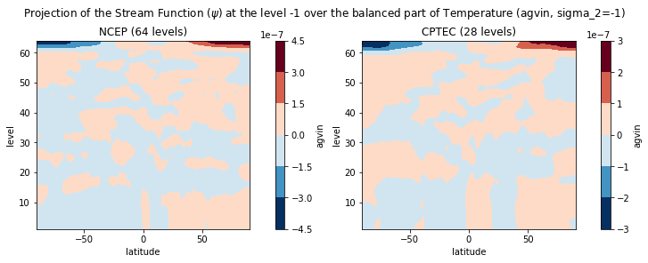
    
For the `bgvin` record:

=== "Command"

    ```python linenums="1"
    fig, ax = plt.subplots(1, 2, constrained_layout=True, figsize=(10,4))
    
    ncep_b.balprojs['bgvin'].plot.contourf(ax=ax[0])#, vmin=0, vmax=0.5)
    cptec_b.balprojs['bgvin'].plot.contourf(ax=ax[1])#, vmin=0, vmax=0.5)
    
    ax[0].set_title('NCEP (64 níveis)')
    ax[1].set_title('CPTEC (28 níveis)')
    
    plt.suptitle('Coeficientes de Regressão Função de Corrente sobre a parte balanceada da Velocidade Potencial (bgvin)')
    plt.show()
    ```

=== "Result"
    
    
    
For the `wgvin` record:

=== "Command"

    ```python linenums="1"
    fig, ax = plt.subplots(1, 2, constrained_layout=True, figsize=(10,4))
    
    ncep_b.balprojs['wgvin'].plot.contourf(ax=ax[0])#, vmin=-3e-7, vmax=3e-7)
    cptec_b.balprojs['wgvin'].plot.contourf(ax=ax[1])#, vmin=-3e-7, vmax=3e-7)
    
    ax[0].set_title('NCEP (64 níveis)')
    ax[1].set_title('CPTEC (28 níveis)')
    
    plt.suptitle('Coeficientes de Regressão Função de Corrente sobre a parte balanceada da Pressão em Superfície (wgvin)')
    plt.show()
    ```

=== "Result"
    
    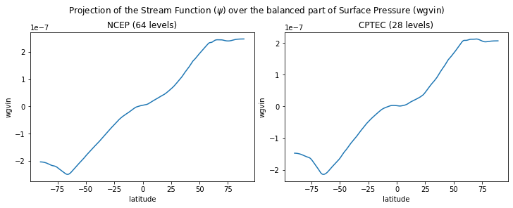
    
### Amplitudes (standard deviations)

To check and compare the amplitudes from the instances `ncep_b` and `cptec_b`, see the next examples.

=== "Command"

    ```python linenums="1"
    fig, ax = plt.subplots(1, 2, constrained_layout=True, figsize=(10,4))
    
    ncep_b.amplitudes['sf'].plot.contourf(ax=ax[0])#, vmin=0, vmax=6e6)
    cptec_b.amplitudes['sf'].plot.contourf(ax=ax[1])#, vmin=0, vmax=6e6)
    
    ax[0].set_title('NCEP (64 níveis)')
    ax[1].set_title('CPTEC (28 níveis)')
    
    plt.suptitle('Desvio Padrão da Parte não balanceada da Função de Corrente (sf)')
    plt.show()
    ```

=== "Result"
    
    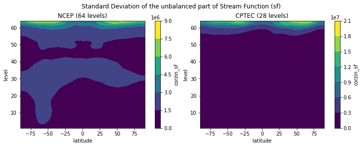
    
In the following example, the vertical profiles from the amplitudes of the streamfunction `sf` from the instances `ncep_b` and `cptec_b` are compared:

=== "Command"

    ```python linenums="1"
    fig, ax = plt.subplots(1, 2, constrained_layout=True, figsize=(8,5))
    
    ncep_b.amplitudes['sf'].mean(dim='latitude').plot(ax=ax[0], y='sigma')
    cptec_b.amplitudes['sf'].mean(dim='latitude').plot(ax=ax[1], y='sigma')
    
    ax[0].set_title('NCEP (64 níveis)')
    ax[1].set_title('CPTEC (28 níveis)')
    
    plt.suptitle('Perfil do Desvio Padrão da Parte não balanceada da Função de Corrente (sf)')
    plt.show()
    ```

=== "Result"
    
    
    

For the velocity potential (`vp`):

=== "Command"

    ```python linenums="1"
    fig, ax = plt.subplots(1, 2, constrained_layout=True, figsize=(10,4))
    
    ncep_b.amplitudes['vp'].plot.contourf(ax=ax[0])#, vmin=0, vmax=6e6)
    cptec_b.amplitudes['vp'].plot.contourf(ax=ax[1])#, vmin=0, vmax=6e6)
    
    ax[0].set_title('NCEP (64 níveis)')
    ax[1].set_title('CPTEC (28 níveis)')
    
    plt.suptitle('Desvio Padrão da Parte não balanceada da Velocidade Potencial (vp)')
    plt.show()
    ```

=== "Result"

    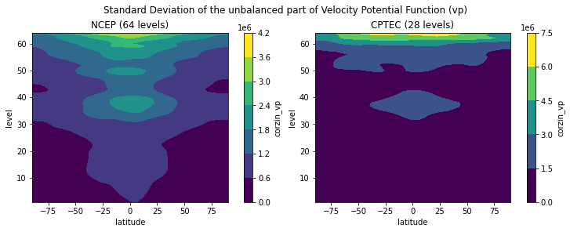
    
For the vertical profile of the velocity potential (`vp`):

=== "Command"

    ```python linenums="1"
    fig, ax = plt.subplots(1, 2, constrained_layout=True, figsize=(8,5))
    
    ncep_b.amplitudes['vp'].mean(dim='latitude').plot(ax=ax[0], y='sigma')
    cptec_b.amplitudes['vp'].mean(dim='latitude').plot(ax=ax[1], y='sigma')
    
    ax[0].set_title('NCEP (64 níveis)')
    ax[1].set_title('CPTEC (28 níveis)')
    
    plt.suptitle('Perfil do Desvio Padrão da Parte não balanceada da Velocidade Potencial (vp)')
    plt.show()
    ```

=== "Result"
    
    
    
For the temperature (`t`):

=== "Command"

    ```python linenums="1"
    fig, ax = plt.subplots(1, 2, constrained_layout=True, figsize=(10,4))
    
    ncep_b.amplitudes['t'].plot.contourf(ax=ax[0])#, vmin=0, vmax=5)
    cptec_b.amplitudes['t'].plot.contourf(ax=ax[1])#, vmin=0, vmax=5)
    
    ax[0].set_title('NCEP (64 níveis)')
    ax[1].set_title('CPTEC (28 níveis)')
    
    plt.suptitle('Desvio Padrão da Parte não balanceada da Temperatura (t)')
    plt.show()
    ```

=== "Result"
  
    
     
For the vertical profile of the temperature (`t`):

=== "Command"

    ```python linenums="1"
    fig, ax = plt.subplots(1, 2, constrained_layout=True, figsize=(8,5))
    
    ncep_b.amplitudes['t'].mean(dim='latitude').plot(ax=ax[0], y='sigma')
    cptec_b.amplitudes['t'].mean(dim='latitude').plot(ax=ax[1], y='sigma')
    
    ax[0].set_title('NCEP (64 níveis)')
    ax[1].set_title('CPTEC (28 níveis)')
    
    plt.suptitle('Perfil do Desvio Padrão da Parte não balanceada da Temperatura (t)')
    plt.show()
    ```

=== "Result"
    
    

For the relative humidity (`q`):
    
=== "Command"

    ```python linenums="1"
    fig, ax = plt.subplots(1, 2, constrained_layout=True, figsize=(10,4))
    
    ncep_b.amplitudes['q'].plot.contourf(ax=ax[0])#, vmin=0, vmax=0.5)
    cptec_b.amplitudes['q'].plot.contourf(ax=ax[1])#, vmin=0, vmax=0.5)
    
    ax[0].set_title('NCEP (64 níveis)')
    ax[1].set_title('CPTEC (28 níveis)')
    
    plt.suptitle('Desvio Padrão da Umidade Relativa (q)')
    plt.show()
    ```

=== "Result"
        
    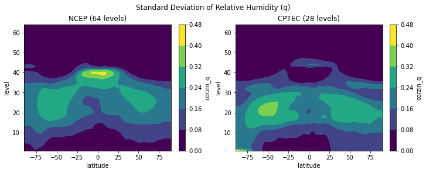
    
For the vertical profile of the relative humidity (`q`):

=== "Command"

    ```python linenums="1"
    fig, ax = plt.subplots(1, 2, constrained_layout=True, figsize=(8,5))
    
    ncep_b.amplitudes['q'].mean(dim='latitude').plot(ax=ax[0], y='sigma')
    cptec_b.amplitudes['q'].mean(dim='latitude').plot(ax=ax[1], y='sigma')
    
    ax[0].set_title('NCEP (64 níveis)')
    ax[1].set_title('CPTEC (28 níveis)')
    
    plt.suptitle('Perfil do Desvio Padrão da Umidade Relativa (q)')
    plt.show()
    ```

=== "Result"
    
    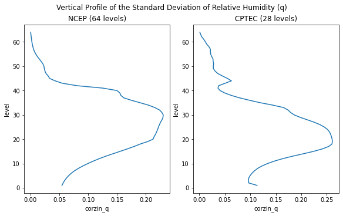

For the ozone (`oz`):

=== "Command"

    ```python linenums="1"
    fig, ax = plt.subplots(1, 2, constrained_layout=True, figsize=(10,4))
    
    ncep_b.amplitudes['oz'].plot.contourf(ax=ax[0])#, vmin=0, vmax=7.5e-7)
    cptec_b.amplitudes['oz'].plot.contourf(ax=ax[1])#, vmin=0, vmax=7.5e-7)
    
    ax[0].set_title('NCEP (64 níveis)')
    ax[1].set_title('CPTEC (28 níveis)')
    
    plt.suptitle('Desvio Padrão do Ozônio (oz)')
    plt.show()
    ```

=== "Result"
    
    

For the vertical profile of the ozone (`oz`):
    
=== "Command"

    ```python linenums="1"
    fig, ax = plt.subplots(1, 2, constrained_layout=True, figsize=(8,5))
    
    ncep_b.amplitudes['oz'].mean(dim='latitude').plot(ax=ax[0], y='sigma')
    cptec_b.amplitudes['oz'].mean(dim='latitude').plot(ax=ax[1], y='sigma')
    
    ax[0].set_title('NCEP (64 níveis)')
    ax[1].set_title('CPTEC (28 níveis)')
    
    plt.suptitle('Perfil do Desvio Padrão do Ozônio (oz)')
    plt.show()
    ```

=== "Result"
    
    

For the cloud water content (`cw`):
    
=== "Command"

    ```python linenums="1"
    fig, ax = plt.subplots(1, 2, constrained_layout=True, figsize=(10,4))
    
    ncep_b.amplitudes['cw'].plot.contourf(ax=ax[0])#, vmin=0, vmax=7.5e-7)
    cptec_b.amplitudes['cw'].plot.contourf(ax=ax[1])#, vmin=0, vmax=7.5e-7)
    
    ax[0].set_title('NCEP (64 níveis)')
    ax[1].set_title('CPTEC (28 níveis)')
    
    plt.suptitle('Desvio Padrão do Conteúdo de Água Líquida em Nuvens (cw)')
    plt.show()
    ```

=== "Result"
    
    

For the vertical profile of the cloud water content (`cw`):

=== "Command"

    ```python linenums="1"
    fig, ax = plt.subplots(1, 2, constrained_layout=True, figsize=(8,5))
    
    ncep_b.amplitudes['cw'].mean(dim='latitude').plot(ax=ax[0], y='sigma')
    cptec_b.amplitudes['cw'].mean(dim='latitude').plot(ax=ax[1], y='sigma')
    
    ax[0].set_title('NCEP (64 níveis)')
    ax[1].set_title('CPTEC (28 níveis)')
    
    plt.suptitle('Perfil do Desvio Padrão do Conteúdo de Água Líquida em Nuvens (cw)')
    plt.show()
    ```

=== "Result"
    
    

For the surface pressure (`ps`):

=== "Command"

    ```python linenums="1"
    fig, ax = plt.subplots(1, 2, constrained_layout=True, figsize=(10,4))
    
    ncep_b.amplitudes['ps'].plot(ax=ax[0])#, vmin=0, vmax=0.2)
    cptec_b.amplitudes['ps'].plot(ax=ax[1])#, vmin=0, vmax=0.2)
    
    ax[0].set_title('NCEP')
    ax[1].set_title('CPTEC')
    
    plt.suptitle('Desvio Padrão da Pressão em Superfície (ps)')
    plt.show()
    ```
=== "Result"
    
    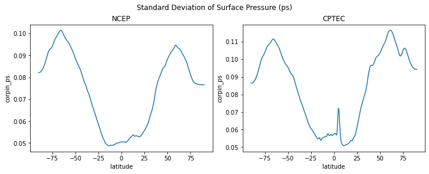

In the next figures, the amplitudes of the sea surface temperature (`sst`) for the instances `ncep_b` and `cptec_b` are shown.

=== "Command"

    ```python linenums="1"
    plt.figure(figsize=(20,4))#, constrained_layout=True)
    
    ax1 = plt.subplot(1, 2, 1, projection=ccrs.PlateCarree())
    ax1.add_feature(cfeature.NaturalEarthFeature('physical', 'land', '110m', edgecolor='face', facecolor='white'))
    obj1 = ax1.contourf(ncep_b.lons, ncep_b.lats, ncep_b.amplitudes['sst'], 60, transform=ccrs.PlateCarree())
    plt.colorbar(obj1)
    ax1.coastlines()
    
    ax2 = plt.subplot(1, 2, 2, projection=ccrs.PlateCarree())
    ax2.add_feature(cfeature.NaturalEarthFeature('physical', 'land', '110m', edgecolor='face', facecolor='white'))
    obj2 = ax2.contourf(cptec_b.lons, cptec_b.lats, cptec_b.amplitudes['sst'], 60, transform=ccrs.PlateCarree())
    plt.colorbar(obj2)
    ax2.coastlines()
    
    ax1.set_title('NCEP')
    ax2.set_title('CPTEC')
    
    plt.suptitle('Desvio Padrão da Temperatura da Superfície do Mar (sst)')
    plt.show()
    ```

=== "Result"
    
    
    
### Horizontal length scales

In the same manner we did for the amplitudes, the horizontal length scales from the instances `ncep_b` and `cptec_b` can also be compared. See the next examples.

=== "Command"

    ```python linenums="1"
    fig, ax = plt.subplots(1, 2, constrained_layout=True, figsize=(10,4))
    
    ncep_b.hscales['sf'].plot.contourf(ax=ax[0])#, vmin=0, vmax=1.5e6)
    cptec_b.hscales['sf'].plot.contourf(ax=ax[1])#, vmin=0, vmax=1.5e6)
    
    ax[0].set_title('NCEP (64 níveis)')
    ax[1].set_title('CPTEC (28 níveis)')
    
    plt.suptitle('Comprimentos de Escala Horizontais da Função de Corrente (sf)')
    plt.show()
    ```

=== "Result"
    
    

For the velocity potential (`vp`):

=== "Command"

    ```python linenums="1"
    fig, ax = plt.subplots(1, 2, constrained_layout=True, figsize=(10,4))
    
    ncep_b.hscales['vp'].plot.contourf(ax=ax[0])#, vmin=0, vmax=1.5e6)
    cptec_b.hscales['vp'].plot.contourf(ax=ax[1])#, vmin=0, vmax=1.5e6)
    
    ax[0].set_title('NCEP (64 níveis)')
    ax[1].set_title('CPTEC (28 níveis)')
    
    plt.suptitle('Comprimentos de Escala Horizontais da Velocidade Potencial (vp)')
    plt.show()
    ```

=== "Result"
    
    
    
For the temperature (`t`):

=== "Command"

    ```python linenums="1"
    fig, ax = plt.subplots(1, 2, constrained_layout=True, figsize=(10,4))
    
    ncep_b.hscales['t'].plot.contourf(ax=ax[0])#, vmin=0, vmax=3.5e5)
    cptec_b.hscales['t'].plot.contourf(ax=ax[1])#, vmin=0, vmax=3.5e5)
    
    ax[0].set_title('NCEP (64 níveis)')
    ax[1].set_title('CPTEC (28 níveis)')
    
    plt.suptitle('Comprimentos de Escala Horizontais da Temperatura (t)')
    plt.show()
    ```

=== "Result"
    
    
    
For the relative humidity (`q`):

=== "Command"

    ```python linenums="1"
    fig, ax = plt.subplots(1, 2, constrained_layout=True, figsize=(10,4))
    
    ncep_b.hscales['q'].plot.contourf(ax=ax[0])#, vmin=0, vmax=1.5e5)
    cptec_b.hscales['q'].plot.contourf(ax=ax[1])#, vmin=0, vmax=1.5e5)
    
    ax[0].set_title('NCEP (64 níveis)')
    ax[1].set_title('CPTEC (28 níveis)')
    
    plt.suptitle('Comprimentos de Escala Horizontais da Umidade Relativa (q)')
    plt.show()
    ```

=== "Result"
    
    

For the ozone (`oz`):

=== "Command"

    ```python linenums="1"
    fig, ax = plt.subplots(1, 2, constrained_layout=True, figsize=(10,4))
    
    ncep_b.hscales['oz'].plot.contourf(ax=ax[0])#, vmin=0, vmax=2.5e5)
    cptec_b.hscales['oz'].plot.contourf(ax=ax[1])#, vmin=0, vmax=2.5e5)
    
    ax[0].set_title('NCEP (64 níveis)')
    ax[1].set_title('CPTEC (28 níveis)')
    
    plt.suptitle('Comprimentos de Escala Horizontais Ozônio (oz)')
    plt.show()
    ```

=== "Result"
    
    
    
For the surface pressure (`ps`):

=== "Command"

    ```python linenums="1"
    fig, ax = plt.subplots(1, 2, constrained_layout=True, figsize=(10,4))
    
    ncep_b.hscales['ps'].plot(ax=ax[0])#, vmin=0, vmax=2.5e5)
    cptec_b.hscales['ps'].plot(ax=ax[1])#, vmin=0, vmax=2.5e5)
    
    ax[0].set_title('NCEP (64 níveis)')
    ax[1].set_title('CPTEC (28 níveis)')
    
    plt.suptitle('Comprimentos de Escala Horizontais Pressão em Superfície (ps)')
    plt.show()
    ```

=== "Result"
    
    
    
For the sea surface temperature (`sst`):

=== "Command"

    ```python linenums="1"
    plt.figure(figsize=(20,4))#, constrained_layout=True)
    
    ax1 = plt.subplot(1, 2, 1, projection=ccrs.PlateCarree())
    ax1.add_feature(cfeature.NaturalEarthFeature('physical', 'land', '110m', edgecolor='face', facecolor='white'))
    obj1 = ax1.contourf(ncep_b.lons, ncep_b.lats, ncep_b.hscales['sst'], 60, transform=ccrs.PlateCarree())
    plt.colorbar(obj1)
    ax1.coastlines()
    
    ax2 = plt.subplot(1, 2, 2, projection=ccrs.PlateCarree())
    ax2.add_feature(cfeature.NaturalEarthFeature('physical', 'land', '110m', edgecolor='face', facecolor='white'))
    obj2 = ax2.contourf(cptec_b.lons, cptec_b.lats, cptec_b.hscales['sst'], 60, transform=ccrs.PlateCarree())
    plt.colorbar(obj2)
    ax2.coastlines()
    
    ax1.set_title('NCEP')
    ax2.set_title('CPTEC')
    
    plt.suptitle('Comprimentos de Escala Horizontais da Temperatura da Superfície do Mar (sst)')
    plt.show()
    ```

=== "Result"
    
    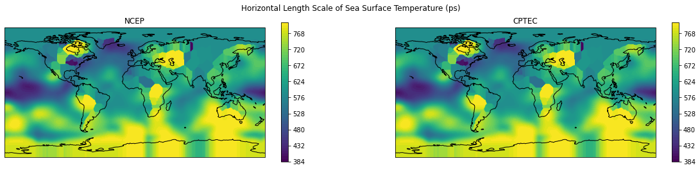
    
### Vertical length scales

In the same manner we did for the amplitudes, the vertical length scales from the instances `ncep_b` and `cptec_b` can also be compared. See the next examples.

=== "Command"

    ```python linenums="1"
    fig, ax = plt.subplots(1, 2, constrained_layout=True, figsize=(10,4))
    
    ncep_b.vscales['sf'].plot.contourf(ax=ax[0])#, vmin=0, vmax=2.5e5)
    cptec_b.vscales['sf'].plot.contourf(ax=ax[1])#, vmin=0, vmax=2.5e5)
    
    ax[0].set_title('NCEP (64 níveis)')
    ax[1].set_title('CPTEC (28 níveis)')
    
    plt.suptitle('Comprimentos de Escala Verticais da Função de Corrente (sf)')
    plt.show()
    ```

=== "Result"
    
    

For the velocity potential (`vp`):
    
=== "Command"

    ```python linenums="1"
    fig, ax = plt.subplots(1, 2, constrained_layout=True, figsize=(10,4))
    
    ncep_b.vscales['vp'].plot.contourf(ax=ax[0])#, vmin=0, vmax=2.5e5)
    cptec_b.vscales['vp'].plot.contourf(ax=ax[1])#, vmin=0, vmax=2.5e5)
    
    ax[0].set_title('NCEP (64 níveis)')
    ax[1].set_title('CPTEC (28 níveis)')
    
    plt.suptitle('Comprimentos de Escala Verticais da Velocidade Potencial (vp)')
    plt.show()
    ```

=== "Result"
    
    
    
For the temperature (`t`):

=== "Command"

    ```python linenums="1"
    fig, ax = plt.subplots(1, 2, constrained_layout=True, figsize=(10,4))
    
    ncep_b.vscales['t'].plot.contourf(ax=ax[0])#, vmin=0, vmax=2.5e5)
    cptec_b.vscales['t'].plot.contourf(ax=ax[1])#, vmin=0, vmax=2.5e5)
    
    ax[0].set_title('NCEP (64 níveis)')
    ax[1].set_title('CPTEC (28 níveis)')
    
    plt.suptitle('Comprimentos de Escala Verticais da Temperatura (t)')
    plt.show()
    ```

=== "Result"
    
    
    
For the relative humidity (`q`):

=== "Command"

    ```python linenums="1"
    fig, ax = plt.subplots(1, 2, constrained_layout=True, figsize=(10,4))
    
    ncep_b.vscales['q'].plot.contourf(ax=ax[0])#, vmin=0, vmax=2.5e5)
    cptec_b.vscales['q'].plot.contourf(ax=ax[1])#, vmin=0, vmax=2.5e5)
    
    ax[0].set_title('NCEP (64 níveis)')
    ax[1].set_title('CPTEC (28 níveis)')
    
    plt.suptitle('Comprimentos de Escala Verticais da Umidade Relativa (q)')
    plt.show()
    ```

=== "Result"
    
    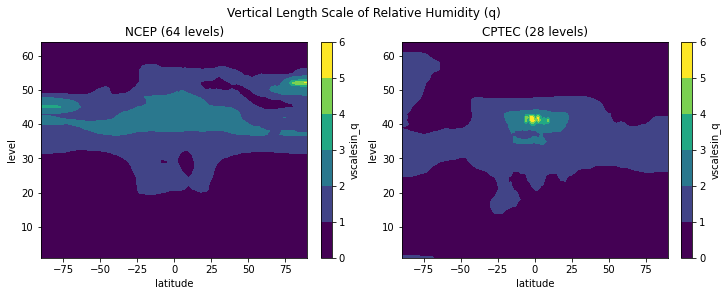
    
For the ozone (`oz`):

=== "Command"

    ```python linenums="1"
    fig, ax = plt.subplots(1, 2, constrained_layout=True, figsize=(10,4))
    
    ncep_b.vscales['oz'].plot.contourf(ax=ax[0])#, vmin=0, vmax=2.5e5)
    cptec_b.vscales['oz'].plot.contourf(ax=ax[1])#, vmin=0, vmax=2.5e5)
    
    ax[0].set_title('NCEP (64 níveis)')
    ax[1].set_title('CPTEC (28 níveis)')
    
    plt.suptitle('Comprimentos de Escala Verticais do Ozônio (oz)')
    plt.show()
    ```

=== "Result"
    
    
    
For the cloud water content (`cw`):

=== "Command"

    ```python linenums="1"
    fig, ax = plt.subplots(1, 2, constrained_layout=True, figsize=(10,4))
    
    ncep_b.vscales['cw'].plot.contourf(ax=ax[0])#, vmin=0, vmax=2.5e5)
    cptec_b.vscales['cw'].plot.contourf(ax=ax[1])#, vmin=0, vmax=2.5e5)
    
    ax[0].set_title('NCEP (64 níveis)')
    ax[1].set_title('CPTEC (28 níveis)')
    
    plt.suptitle('Comprimentos de Escala Verticais do Conteúdo de Água Líquida em Nuvens (cw)')
    plt.show()
    ```

=== "Result"
    
    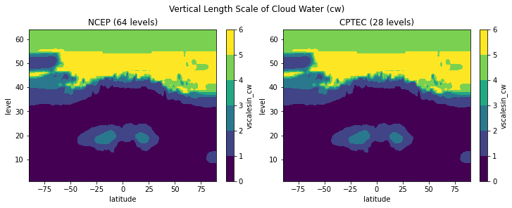
