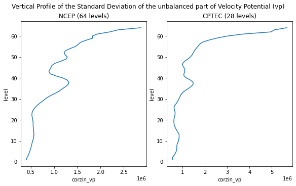
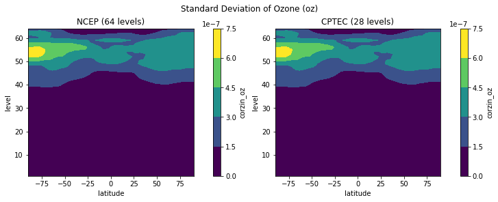
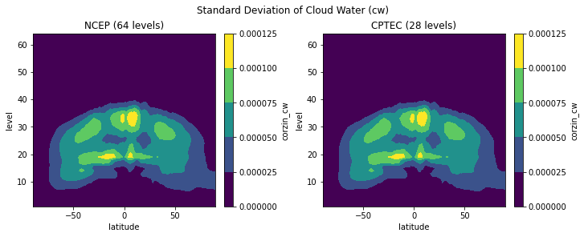
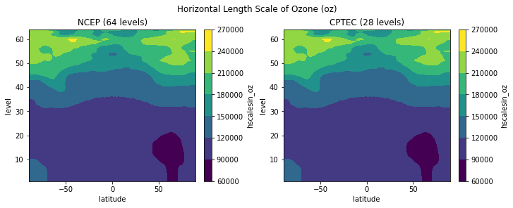

# Uso 

Nesta página são apresentados alguns exemplos de uso da classe `GSIBerror`. Nos exemplos, são consideradas duas matrizes de covariâncias, uma proveniente do _Developmental Testbed Center_ ([DTC](https://dtcenter.org/)) e outra calculada a partir dos pares de previsões do modelo de circulação geral da atmosfera do CPTEC[^1].

[^1]: Matriz de Covariâncias dos Erros de Previsão Aplicada ao Sistema de Assimilação de Dados Global do CPTEC: Experimentos com Observação Única. Disponível em: [https://www.scielo.br/j/rbmet/a/8LQNdCV9jJM9whJdpkDLfCh/abstract/?lang=pt&format=html](https://www.scielo.br/j/rbmet/a/8LQNdCV9jJM9whJdpkDLfCh/abstract/?lang=pt&format=html).

!!! info "Informação"

    Uma versão desta página para o Jupyter Notebook pode ser encontrada em [https://github.com/cfbastarz/GSIBerror/blob/main/read_gsi_berror_python-class-final.ipynb](https://github.com/cfbastarz/GSIBerror/blob/main/read_gsi_berror_python-class-final.ipynb). 

    Se preferir interagir com o notebook, clique no botão abaixo para utilizar o Binder.

    [](https://mybinder.org/v2/gh/cfbastarz/GSIBerror/main)

## A classe `GSIBerror`

Para utilizar a classe, carregue-a com o comando a seguir:

=== "Comando"

    ```python linenums="1"
    from GSIBerror import Berror
    ```

Os módulos a seguir são opcionais e podem ser carregados caso o usuário queira plotar os records da matriz. O módulo `cartopy` é carregado para plotar as linhas de costa dos records relacionados com a `sst` (temperatura da superfície do mar) apenas, visto que os demais records, são dependentes apenas das latitudes:

=== "Comando"

    ```python linenums="1"
    import os
    import matplotlib.pyplot as plt
    import cartopy.crs as ccrs
    import cartopy.feature as cfeature
    
    %matplotlib inline
    ```

!!! info "Observação"

    No repositório, está disponível o script [`plot_functions.py`](https://github.com/GAD-DIMNT-CPTEC/GSIBerror/blob/main/plot_functions.py) onde estão implementadas algumas funções de plotagem auxiliares para a utilização do módulo GSIBerror. Veja um exemplo da sua utilização no notebook [`read_gsi_berror_python-class-final-BCPTEC_hyb_coord-compara-exemplos.ipynb`](https://github.com/GAD-DIMNT-CPTEC/GSIBerror/blob/main/read_gsi_berror_python-class-final-BCPTEC_hyb_coord-compara-exemplos.ipynb). Nesse notebook, diferente do que é apresentado neste manual de uso, são utilizadas duas matrizes com a mesma quantidade de níveis verticais.


## Definição dos arquivos de covariâncias

A seguir, define-se o nome do arquivo a ser lido. No exemplo dado neste notebook, são abertas duas matrizes, `fncep` (matriz do NCEP) e `fcptec` (matriz do modelo BAM). Ambas as matrizes possuem dimensões distintas:


=== "Comando"

    ```python linenums="1"
    path = '/dados/das/pesq1/BAM.berror/xc50/old/'
    
    bcptec = 'gsir4.berror_stats.gcv.BAM.TQ0062L028'
    bncep = 'global_berror.l64y386.f77-ncep-dtc.gcv'
    
    fncep = os.path.join(path, bncep)
    fcptec = os.path.join(path, bcptec)
    ```

## Utilização da classe `GSIBerror`

Para utilizar a classe, é necessário criar uma instância para cada uma das matrizes a serem lidas:

=== "Comando"

    ```python linenums="1"
    ncep_b = Berror(fncep)
    cptec_b = Berror(fcptec)

    ```

## O método `read_records`

O método `read_records` é utilizado para ler todos os records (coeficientes de regressão horizontais, comprimentos de escala e variâncias) das matrizes e os seus respectivos atributos (número de pontos de latitude, longitude, níveis verticais) . A documentação deste método pode ser acessada com o comando:

=== "Comando"

    ```python linenums="1"
    help(Berror.read_records)
    ```
=== "Resultado"

    ```python linenums="1"
    Help on function read_records in module GSIBerror:
    
    read_records(self)
        read_records
        ------------
        
        Este método lê os três primeiros records da matriz de covariâncias (nlat, nlon e nsig) e
        os utiliza para calcular o tamanho dos demais records da matriz. Todos os atributos da matriz lida
        são providos por esta função. A plotagem dos records é feita a partir do método 'plot()' do xarray;
        dependendo do uso, pode ser necessário carregar os módulos matplotlib e cartopy.
        
        Parâmetros de entrada
        ---------------------
            Nenhum.
        
        Resultado
        ---------
            bfile: objeto criado com os records e os atributos da matriz de covariâncias (veja a lista a seguir)
                   
        Atributos disponíveis
        ---------------------
            file_name         : string com o nome do arquivo lido
            nlat              : integer com o número de pontos de latitude
            nlon              : integer com o número de pontos de longitude
            nsig              : integer com o número de níveis verticais
            lats              : nd-array com as latitudes (-90 a 90)
            lons              : nd-array com as longitudes (0 a 360)
            levs              : nd-array com os níveis (1 a nsig)
            amplitudes        : dicionário de xarrays com as amplitudes das variáveis
            amplitudes_names  : nomes das variáveis que compoem o dicionário amplitudes
            balprojs          : dicionário de xarrays com as matrizes de projeção da temperatura, 
                                pressão e velocidade potencial
            hscales           : dicionário de xarrays com os comprimentos de escala horizontais
            hscales_var_names : nomes das variáveis que compoem o dicionário hscales
            vscales           : dicionário de xarrays com os comprimentos de escala verticais
            vscales_var_names : nomes das variáveis que compoem o dicionário vscales
                    
        Uso
        ---
            from GSIBerror import Berror
        
            bfile = Berror('arquivo_matriz_B.gcv')
        
            bfile.read_records()
            
            bfile.nlat, bfile.nlon, bfile.nsig
            
            bfile.amplitudes_names
            
            bfile.amplitudes['sf']
            
            bfile_amp_sf = bfile.amplitudes['sf']
            
            bfile_amp_sf.plot.contourf()
    ``` 

Leituras dos records e atributos das matrizes a partir das instâncias `ncep_b` e `cptec_b` criadas:

=== "Comando"

    ```python linenums="1"
    ncep_b.read_records()
    cptec_b.read_records()
    ```

## Verificação dos atributos das matrizes

A matriz de covariâncias utilizada pelo GSI possui uma série de records que podem ser verificados por meio da classe `GSIBerror`.

### Dimensões das matrizes

Para verificar os atributos das matrizes, basta utilizar a instância da classe para a matriz desejada:

* `nlat`: número de pontos de latitude;
* `nlon`: número de pontos de longitude;
* `nsig`: número de níveis verticais.

=== "Comando"

    ```python linenums="1"
    ncep_b.nlat, ncep_b.nlon, ncep_b.nsig
    ```

=== "Resultado"

    ```python linenums="1"
    (386, 768, 64)
    ```

Da mesma forma, para `cptec_b`:

=== "Comando"

    ```python linenums="1"
    cptec_b.nlat, cptec_b.nlon, cptec_b.nsig
    ```

=== "Resultado"

    ```python linenums="1"
    (98, 192, 28)
    ```

### Coeficientes de regressão horizontais

Para verificar os records das matrizes, basta utilizar a instância da classe para a matriz desejada:

* `balprojs`: coeficientes de regressão horizontais;
* `amplitudes`: variâncias das variáveis de controle;
* `hscales`: comprimentos de escala horizontais;
* `vscales`: comprimentos de escala verticais.

=== "Comando"

    ```python linenums="1"
    ncep_b.balprojs
    ```

=== "Resultado"

    ```python linenums="1"
    {'agvin': <xarray.DataArray 'agvin' (sigma: 64, latitude: 386, sigma_2: 64)>
     array([[[ 9.1390668e-39, -1.4570713e-08, -1.4229909e-08, ...,
               1.9885631e-07, -3.0927532e-07, -1.5866360e-07],
             [ 1.9645067e-07,  2.0414565e-07,  2.1749047e-07, ...,
               3.9498239e-08,  2.1559554e-08, -2.6009864e-08],
             [ 1.9645067e-07,  2.0414565e-07,  2.1749047e-07, ...,
               3.9498239e-08,  2.1559554e-08, -2.6009864e-08],
             ...,
             [-4.0456254e-07, -4.1785779e-07, -4.3682641e-07, ...,
               4.0088888e-10, -7.6423277e-08,  3.1785959e-08],
             [-4.0533263e-07, -4.1864789e-07, -4.3763430e-07, ...,
               5.5518179e-10, -7.6580413e-08,  3.1765442e-08],
             [-4.0576197e-07, -4.1908416e-07, -4.3808009e-07, ...,
               6.3978484e-10, -7.6664413e-08,  3.1752339e-08]],
     
            [[-4.0576197e-07, -4.1908416e-07, -4.3808009e-07, ...,
               6.3978484e-10, -7.6664413e-08,  3.1752339e-08],
             [ 1.9722712e-07,  2.0493923e-07,  2.1830989e-07, ...,
               3.6942918e-08,  2.0000796e-08, -2.4325955e-08],
             [ 1.9722712e-07,  2.0493923e-07,  2.1830989e-07, ...,
               3.6942918e-08,  2.0000796e-08, -2.4325955e-08],
     ...
             [-1.4934518e-08, -1.4844422e-08, -1.4163690e-08, ...,
              -2.2026695e-07, -7.9369016e-08,  3.3956766e-07],
             [-1.5031601e-08, -1.4944586e-08, -1.4267745e-08, ...,
              -2.2030216e-07, -7.9460399e-08,  3.3963573e-07],
             [-1.5084682e-08, -1.5000639e-08, -1.4326437e-08, ...,
              -2.2031999e-07, -7.9510286e-08,  3.3967311e-07]],
     
            [[-1.5084682e-08, -1.5000639e-08, -1.4326437e-08, ...,
              -2.2031999e-07, -7.9510286e-08,  3.3967311e-07],
             [ 8.5512752e-09,  8.5789829e-09,  8.2154630e-09, ...,
               2.4457648e-07,  8.1705295e-08, -3.7984395e-07],
             [ 8.5512752e-09,  8.5789829e-09,  8.2154630e-09, ...,
               2.4457648e-07,  8.1705295e-08, -3.7984395e-07],
             ...,
             [-1.4472619e-08, -1.4127865e-08, -1.2758253e-08, ...,
              -3.0925835e-07, -1.5847982e-07,  4.0097532e-07],
             [-1.4536464e-08, -1.4193026e-08, -1.2824126e-08, ...,
              -3.0927063e-07, -1.5859801e-07,  4.0104135e-07],
             [-1.4570713e-08, -1.4229909e-08, -1.2862232e-08, ...,
              -3.0927532e-07, -1.5866360e-07,  4.0107770e-07]]], dtype=float32)
     Coordinates:
       * latitude  (latitude) float64 -90.0 -89.53 -89.06 -88.6 ... 89.06 89.53 90.0
       * sigma     (sigma) int64 1 2 3 4 5 6 7 8 9 10 ... 56 57 58 59 60 61 62 63 64
       * sigma_2   (sigma_2) int64 1 2 3 4 5 6 7 8 9 ... 56 57 58 59 60 61 62 63 64,
     'bgvin': <xarray.DataArray 'bgvin' (sigma: 64, latitude: 386)>
     array([[ 0.31404725,  0.31404725,  0.31410804, ..., -0.3134667 ,
             -0.31346098, -0.31346098],
            [ 0.309024  ,  0.309024  ,  0.30907533, ..., -0.30182734,
             -0.30181533, -0.30181533],
            [ 0.29433075,  0.29433075,  0.29436478, ..., -0.27594185,
             -0.27591783, -0.27591783],
            ...,
            [ 0.02594377,  0.02594377,  0.02594201, ...,  0.06056742,
              0.06057847,  0.06057847],
            [-0.03358313, -0.03358313, -0.03357612, ...,  0.05812103,
              0.0581184 ,  0.0581184 ],
            [-0.04917536, -0.04917536, -0.049166  , ...,  0.05161405,
              0.0516182 ,  0.0516182 ]], dtype=float32)
     Coordinates:
       * latitude  (latitude) float64 -90.0 -89.53 -89.06 -88.6 ... 89.06 89.53 90.0
       * sigma     (sigma) int64 1 2 3 4 5 6 7 8 9 10 ... 56 57 58 59 60 61 62 63 64,
     'wgvin': <xarray.DataArray 'wgvin' (sigma: 64, latitude: 386)>
     array([[-2.0349323e-07, -2.0356120e-07, -2.0368390e-07, ...,
              2.4741092e-07,  2.4741092e-07,  0.0000000e+00],
            [ 0.0000000e+00,  0.0000000e+00,  0.0000000e+00, ...,
              0.0000000e+00,  0.0000000e+00,  0.0000000e+00],
            [ 0.0000000e+00,  0.0000000e+00,  0.0000000e+00, ...,
              0.0000000e+00,  0.0000000e+00,  0.0000000e+00],
            ...,
            [ 0.0000000e+00,  0.0000000e+00,  0.0000000e+00, ...,
              0.0000000e+00,  0.0000000e+00,  0.0000000e+00],
            [ 0.0000000e+00,  0.0000000e+00,  0.0000000e+00, ...,
              0.0000000e+00,  0.0000000e+00,  0.0000000e+00],
            [ 0.0000000e+00,  0.0000000e+00,  0.0000000e+00, ...,
              0.0000000e+00,  0.0000000e+00,  9.1390668e-39]], dtype=float32)
     Coordinates:
       * latitude  (latitude) float64 -90.0 -89.53 -89.06 -88.6 ... 89.06 89.53 90.0
       * sigma     (sigma) int64 1 2 3 4 5 6 7 8 9 10 ... 56 57 58 59 60 61 62 63 64}
    ```

Observe que os records de `balprojs` estão armazenados em um dicionário com três elementos `agvin`, `bgvin` e `wgvin`. Estes são os coeficientes de regressão horizontais do GSI, utilizados para construir a parte balanceada da temperatura, velocidade potencial e pressão em superfície:

* `agvin`: coeficientes de regressão para a função de corrente e temperatura;
* `bgvin`: coeficientes de regressão para a função de corrente e velocidade potencial;
* `wgvin`: coeficientes de regressão para a função de corrente e pressão em superfície.

Segundo o manual do GSI[^2]:

> Devido ao tamanho real da matriz de covariâncias (da ordem de $10^6 \times 10^6$), a representação da matriz no GSI é simplificada. Para isso, é utilizado um conjunto ideal de variáveis de controle de análise, que são selecionadas de forma que a correlação cruzada entre elas seja mínima (o que implica em menos termos fora da diagonal principal da matriz). Com isso, o balanço (e.g., massa e vento) entre as variáveis de análise é obtido a partir desses coeficientes de regressão horizontais pré-calculados. Além disso, em relação aos erros de previsão, eles são calculados como distribuições Gaussianas com variâncias e comprimentos de escala pré-calculados (offline) para cada uma das variáveis de controle de análise.

[^2]: Disponível em [https://dtcenter.org/community-code/gridpoint-statistical-interpolation-gsi/documentation](https://dtcenter.org/community-code/gridpoint-statistical-interpolation-gsi/documentation).

Estes records com os coeficientes de regressão podem ser inspecionados da seguinte forma:

=== "Comando"

    ```python linenums="1"
    ncep_b.balprojs['agvin']
    ```

=== "Resultado"

    ```python linenums="1"
    <xarray.DataArray 'agvin' (sigma: 64, latitude: 386, sigma_2: 64)>
    array([[[ 9.1390668e-39, -1.4570713e-08, -1.4229909e-08, ...,
              1.9885631e-07, -3.0927532e-07, -1.5866360e-07],
            [ 1.9645067e-07,  2.0414565e-07,  2.1749047e-07, ...,
              3.9498239e-08,  2.1559554e-08, -2.6009864e-08],
            [ 1.9645067e-07,  2.0414565e-07,  2.1749047e-07, ...,
              3.9498239e-08,  2.1559554e-08, -2.6009864e-08],
            ...,
            [-4.0456254e-07, -4.1785779e-07, -4.3682641e-07, ...,
              4.0088888e-10, -7.6423277e-08,  3.1785959e-08],
            [-4.0533263e-07, -4.1864789e-07, -4.3763430e-07, ...,
              5.5518179e-10, -7.6580413e-08,  3.1765442e-08],
            [-4.0576197e-07, -4.1908416e-07, -4.3808009e-07, ...,
              6.3978484e-10, -7.6664413e-08,  3.1752339e-08]],
    
           [[-4.0576197e-07, -4.1908416e-07, -4.3808009e-07, ...,
              6.3978484e-10, -7.6664413e-08,  3.1752339e-08],
            [ 1.9722712e-07,  2.0493923e-07,  2.1830989e-07, ...,
              3.6942918e-08,  2.0000796e-08, -2.4325955e-08],
            [ 1.9722712e-07,  2.0493923e-07,  2.1830989e-07, ...,
              3.6942918e-08,  2.0000796e-08, -2.4325955e-08],
    ...
            [-1.4934518e-08, -1.4844422e-08, -1.4163690e-08, ...,
             -2.2026695e-07, -7.9369016e-08,  3.3956766e-07],
            [-1.5031601e-08, -1.4944586e-08, -1.4267745e-08, ...,
             -2.2030216e-07, -7.9460399e-08,  3.3963573e-07],
            [-1.5084682e-08, -1.5000639e-08, -1.4326437e-08, ...,
             -2.2031999e-07, -7.9510286e-08,  3.3967311e-07]],
    
           [[-1.5084682e-08, -1.5000639e-08, -1.4326437e-08, ...,
             -2.2031999e-07, -7.9510286e-08,  3.3967311e-07],
            [ 8.5512752e-09,  8.5789829e-09,  8.2154630e-09, ...,
              2.4457648e-07,  8.1705295e-08, -3.7984395e-07],
            [ 8.5512752e-09,  8.5789829e-09,  8.2154630e-09, ...,
              2.4457648e-07,  8.1705295e-08, -3.7984395e-07],
            ...,
            [-1.4472619e-08, -1.4127865e-08, -1.2758253e-08, ...,
             -3.0925835e-07, -1.5847982e-07,  4.0097532e-07],
            [-1.4536464e-08, -1.4193026e-08, -1.2824126e-08, ...,
             -3.0927063e-07, -1.5859801e-07,  4.0104135e-07],
            [-1.4570713e-08, -1.4229909e-08, -1.2862232e-08, ...,
             -3.0927532e-07, -1.5866360e-07,  4.0107770e-07]]], dtype=float32)
    Coordinates:
      * latitude  (latitude) float64 -90.0 -89.53 -89.06 -88.6 ... 89.06 89.53 90.0
      * sigma     (sigma) int64 1 2 3 4 5 6 7 8 9 10 ... 56 57 58 59 60 61 62 63 64
      * sigma_2   (sigma_2) int64 1 2 3 4 5 6 7 8 9 ... 56 57 58 59 60 61 62 63 64
    ```

Para `bgvin`:

=== "Comando"

    ```python linenums="1"
    ncep_b.balprojs['bgvin']
    ```

=== "Resultado"

    ```python linenums="1"
    <xarray.DataArray 'bgvin' (sigma: 64, latitude: 386)>
    array([[ 0.31404725,  0.31404725,  0.31410804, ..., -0.3134667 ,
            -0.31346098, -0.31346098],
           [ 0.309024  ,  0.309024  ,  0.30907533, ..., -0.30182734,
            -0.30181533, -0.30181533],
           [ 0.29433075,  0.29433075,  0.29436478, ..., -0.27594185,
            -0.27591783, -0.27591783],
           ...,
           [ 0.02594377,  0.02594377,  0.02594201, ...,  0.06056742,
             0.06057847,  0.06057847],
           [-0.03358313, -0.03358313, -0.03357612, ...,  0.05812103,
             0.0581184 ,  0.0581184 ],
           [-0.04917536, -0.04917536, -0.049166  , ...,  0.05161405,
             0.0516182 ,  0.0516182 ]], dtype=float32)
    Coordinates:
      * latitude  (latitude) float64 -90.0 -89.53 -89.06 -88.6 ... 89.06 89.53 90.0
      * sigma     (sigma) int64 1 2 3 4 5 6 7 8 9 10 ... 56 57 58 59 60 61 62 63 64
    ```

Para `wgvin`:

=== "Comando"

    ```python linenums="1"
    ncep_b.balprojs['wgvin']
    ```
=== "Resultado"

    ```python linenums="1"
    <xarray.DataArray 'wgvin' (sigma: 64, latitude: 386)>
    array([[-2.0349323e-07, -2.0356120e-07, -2.0368390e-07, ...,
             2.4741092e-07,  2.4741092e-07,  0.0000000e+00],
           [ 0.0000000e+00,  0.0000000e+00,  0.0000000e+00, ...,
             0.0000000e+00,  0.0000000e+00,  0.0000000e+00],
           [ 0.0000000e+00,  0.0000000e+00,  0.0000000e+00, ...,
             0.0000000e+00,  0.0000000e+00,  0.0000000e+00],
           ...,
           [ 0.0000000e+00,  0.0000000e+00,  0.0000000e+00, ...,
             0.0000000e+00,  0.0000000e+00,  0.0000000e+00],
           [ 0.0000000e+00,  0.0000000e+00,  0.0000000e+00, ...,
             0.0000000e+00,  0.0000000e+00,  0.0000000e+00],
           [ 0.0000000e+00,  0.0000000e+00,  0.0000000e+00, ...,
             0.0000000e+00,  0.0000000e+00,  9.1390668e-39]], dtype=float32)
    Coordinates:
      * latitude  (latitude) float64 -90.0 -89.53 -89.06 -88.6 ... 89.06 89.53 90.0
      * sigma     (sigma) int64 1 2 3 4 5 6 7 8 9 10 ... 56 57 58 59 60 61 62 63 64
    ```

Para obter os valores mínimos e máximos, eg., dos coeficientes de regressão da velocidade potencial (`bgvin`), pode-se utilizar os métodos `min()` ou `max()` do módulo `xarray`:

=== "Comando"

    ```python linenums="1"
    ncep_b.balprojs['bgvin'].min()
    ```
=== "Resultado"

    ```python linenums="1"
    <xarray.DataArray 'bgvin' ()>
    array(-0.33616406, dtype=float32)
    ```

E para `max()`:

=== "Comando"

    ```python linenums="1"
    ncep_b.balprojs['bgvin'].max()
    ```

=== "Resultado"

    ```python linenums="1"
    <xarray.DataArray 'bgvin' ()> 
    array(0.3307993, dtype=float32)
    ```

De forma simplificada, pode-se fazer também:

=== "Comando"

    ```python linenums="1"
    ncep_b.balprojs['bgvin'].values.min(), ncep_b.balprojs['bgvin'].values.max()
    ```

=== "Resultado"

    ```python linenums="1"
    (-0.33616406, 0.3307993)
    ```

Para plotar os coeficcientes de projeção da velocidade potencial `bgvin`, basta utilizar o método `plot()` do módulo `xarray`:

=== "Comando"

    ```python linenums="1"
    ncep_b.balprojs['bgvin'].plot()
    ```

=== "Resultado"

    
    

Para `cptec_b`:

=== "Comando"

    ```python linenums="1"
    cptec_b.balprojs['bgvin'].plot()
    ```

=== "Resultado"

    
    
Para comparar os coeficientes de projeção das matrizes instanciadas por `ncep_b` e `cptec_b`, pode-se seguir os exemplos a seguir.

Observe que os coeficientes de projeção da temperatura `agvin`, para as instâncias `ncep_b` e `cptec_b`, possuem uma dimensão extra denominada `sigma_2`. Esta dimensão extra precisa ser fixada para um dos níveis contidos nas instâncias. Utilize o comando `ncep_b.levs` e `cptec_b.levs` para obter os valores possíveis para isto (fazendo-se `isel(sigma_2=0)` escolhe-se o primeiro nível, próximo à superfície e `isel(sigma_2=-1)` escolhe-se o último nível, próximo ao topo do modelo).

=== "Comando"

    ```python linenums="1"
    fig, ax = plt.subplots(1, 2, constrained_layout=True, figsize=(10,4))
    
    ncep_b.balprojs['agvin'].isel(sigma_2=0).plot.contourf(ax=ax[0])#, vmin=0, vmax=5e-7)
    cptec_b.balprojs['agvin'].isel(sigma_2=0).plot.contourf(ax=ax[1])#, vmin=0, vmax=5e-7)
    
    ax[0].set_title('NCEP (64 níveis)')
    ax[1].set_title('CPTEC (28 níveis)')
    
    plt.suptitle('Coeficientes de Regressão Função de Corrente sobre a parte balanceada da Temperatura (agvin, sigma_2=0)')
    plt.show()
    ```

=== "Resultado"
    
    
    
E para o último nível em ambas as matrizes:

=== "Comando"

    ```python linenums="1"
    fig, ax = plt.subplots(1, 2, constrained_layout=True, figsize=(10,4))
    
    ncep_b.balprojs['agvin'].isel(sigma_2=-1).plot.contourf(ax=ax[0])#, vmin=0, vmax=5e-7)
    cptec_b.balprojs['agvin'].isel(sigma_2=-1).plot.contourf(ax=ax[1])#, vmin=0, vmax=5e-7)
    
    ax[0].set_title('NCEP (64 níveis)')
    ax[1].set_title('CPTEC (28 níveis)')
    
    plt.suptitle('Coeficientes de Regressão Função de Corrente sobre a parte balanceada da Temperatura (wgvin, sigma_2=-1)')
    plt.show()
    ```

=== "Resultado"

    
    
Para o record `bgvin`:

=== "Comando"

    ```python linenums="1"
    fig, ax = plt.subplots(1, 2, constrained_layout=True, figsize=(10,4))
    
    ncep_b.balprojs['bgvin'].plot.contourf(ax=ax[0])#, vmin=0, vmax=0.5)
    cptec_b.balprojs['bgvin'].plot.contourf(ax=ax[1])#, vmin=0, vmax=0.5)
    
    ax[0].set_title('NCEP (64 níveis)')
    ax[1].set_title('CPTEC (28 níveis)')
    
    plt.suptitle('Coeficientes de Regressão Função de Corrente sobre a parte balanceada da Velocidade Potencial (bgvin)')
    plt.show()
    ```

=== "Resultado"
    
    
    
Para o record `wgvin`:

=== "Comando"

    ```python linenums="1"
    fig, ax = plt.subplots(1, 2, constrained_layout=True, figsize=(10,4))
    
    ncep_b.balprojs['wgvin'].plot.contourf(ax=ax[0])#, vmin=-3e-7, vmax=3e-7)
    cptec_b.balprojs['wgvin'].plot.contourf(ax=ax[1])#, vmin=-3e-7, vmax=3e-7)
    
    ax[0].set_title('NCEP (64 níveis)')
    ax[1].set_title('CPTEC (28 níveis)')
    
    plt.suptitle('Coeficientes de Regressão Função de Corrente sobre a parte balanceada da Pressão em Superfície (wgvin)')
    plt.show()
    ```

=== "Resultado"
    
    
    
### Amplitudes (desvios-padrão)

Para verificar e comparar as amplitudes das instâncias `ncep_b` e `cptec_b`, siga os exemplos a seguir.

=== "Comando"

    ```python linenums="1"
    fig, ax = plt.subplots(1, 2, constrained_layout=True, figsize=(10,4))
    
    ncep_b.amplitudes['sf'].plot.contourf(ax=ax[0])#, vmin=0, vmax=6e6)
    cptec_b.amplitudes['sf'].plot.contourf(ax=ax[1])#, vmin=0, vmax=6e6)
    
    ax[0].set_title('NCEP (64 níveis)')
    ax[1].set_title('CPTEC (28 níveis)')
    
    plt.suptitle('Desvio Padrão da Parte não balanceada da Função de Corrente (sf)')
    plt.show()
    ```

=== "Resultado"
    
    
    
No exemplo a seguir, são comparados os perfis verticais com as amplitudes de `sf` das instâncias `ncep_b` e `cptec_b`:

=== "Comando"

    ```python linenums="1"
    fig, ax = plt.subplots(1, 2, constrained_layout=True, figsize=(8,5))
    
    ncep_b.amplitudes['sf'].mean(dim='latitude').plot(ax=ax[0], y='sigma')
    cptec_b.amplitudes['sf'].mean(dim='latitude').plot(ax=ax[1], y='sigma')
    
    ax[0].set_title('NCEP (64 níveis)')
    ax[1].set_title('CPTEC (28 níveis)')
    
    plt.suptitle('Perfil do Desvio Padrão da Parte não balanceada da Função de Corrente (sf)')
    plt.show()
    ```

=== "Resultado"
    
    
    

Para a velocidade potencial (vp):

=== "Comando"

    ```python linenums="1"
    fig, ax = plt.subplots(1, 2, constrained_layout=True, figsize=(10,4))
    
    ncep_b.amplitudes['vp'].plot.contourf(ax=ax[0])#, vmin=0, vmax=6e6)
    cptec_b.amplitudes['vp'].plot.contourf(ax=ax[1])#, vmin=0, vmax=6e6)
    
    ax[0].set_title('NCEP (64 níveis)')
    ax[1].set_title('CPTEC (28 níveis)')
    
    plt.suptitle('Desvio Padrão da Parte não balanceada da Velocidade Potencial (vp)')
    plt.show()
    ```

=== "Resultado"

    
    
Para o perfil da velocidade potencial (vp):

=== "Comando"

    ```python linenums="1"
    fig, ax = plt.subplots(1, 2, constrained_layout=True, figsize=(8,5))
    
    ncep_b.amplitudes['vp'].mean(dim='latitude').plot(ax=ax[0], y='sigma')
    cptec_b.amplitudes['vp'].mean(dim='latitude').plot(ax=ax[1], y='sigma')
    
    ax[0].set_title('NCEP (64 níveis)')
    ax[1].set_title('CPTEC (28 níveis)')
    
    plt.suptitle('Perfil do Desvio Padrão da Parte não balanceada da Velocidade Potencial (vp)')
    plt.show()
    ```

=== "Resultado"
    
    
    
Para a temperatura (t):

=== "Comando"

    ```python linenums="1"
    fig, ax = plt.subplots(1, 2, constrained_layout=True, figsize=(10,4))
    
    ncep_b.amplitudes['t'].plot.contourf(ax=ax[0])#, vmin=0, vmax=5)
    cptec_b.amplitudes['t'].plot.contourf(ax=ax[1])#, vmin=0, vmax=5)
    
    ax[0].set_title('NCEP (64 níveis)')
    ax[1].set_title('CPTEC (28 níveis)')
    
    plt.suptitle('Desvio Padrão da Parte não balanceada da Temperatura (t)')
    plt.show()
    ```

=== "Resultado"
  
    
     
Para o perfil da temperatura (t):

=== "Comando"

    ```python linenums="1"
    fig, ax = plt.subplots(1, 2, constrained_layout=True, figsize=(8,5))
    
    ncep_b.amplitudes['t'].mean(dim='latitude').plot(ax=ax[0], y='sigma')
    cptec_b.amplitudes['t'].mean(dim='latitude').plot(ax=ax[1], y='sigma')
    
    ax[0].set_title('NCEP (64 níveis)')
    ax[1].set_title('CPTEC (28 níveis)')
    
    plt.suptitle('Perfil do Desvio Padrão da Parte não balanceada da Temperatura (t)')
    plt.show()
    ```

=== "Resultado"
    
    

Para a umidade relativa (q):
    
=== "Comando"

    ```python linenums="1"
    fig, ax = plt.subplots(1, 2, constrained_layout=True, figsize=(10,4))
    
    ncep_b.amplitudes['q'].plot.contourf(ax=ax[0])#, vmin=0, vmax=0.5)
    cptec_b.amplitudes['q'].plot.contourf(ax=ax[1])#, vmin=0, vmax=0.5)
    
    ax[0].set_title('NCEP (64 níveis)')
    ax[1].set_title('CPTEC (28 níveis)')
    
    plt.suptitle('Desvio Padrão da Umidade Relativa (q)')
    plt.show()
    ```

=== "Resultado"
        
    
    
Para o perfil da umidade relativa (q):

=== "Comando"

    ```python linenums="1"
    fig, ax = plt.subplots(1, 2, constrained_layout=True, figsize=(8,5))
    
    ncep_b.amplitudes['q'].mean(dim='latitude').plot(ax=ax[0], y='sigma')
    cptec_b.amplitudes['q'].mean(dim='latitude').plot(ax=ax[1], y='sigma')
    
    ax[0].set_title('NCEP (64 níveis)')
    ax[1].set_title('CPTEC (28 níveis)')
    
    plt.suptitle('Perfil do Desvio Padrão da Umidade Relativa (q)')
    plt.show()
    ```

=== "Resultado"
    
    


Para o ozônio (oz):

=== "Comando"

    ```python linenums="1"
    fig, ax = plt.subplots(1, 2, constrained_layout=True, figsize=(10,4))
    
    ncep_b.amplitudes['oz'].plot.contourf(ax=ax[0])#, vmin=0, vmax=7.5e-7)
    cptec_b.amplitudes['oz'].plot.contourf(ax=ax[1])#, vmin=0, vmax=7.5e-7)
    
    ax[0].set_title('NCEP (64 níveis)')
    ax[1].set_title('CPTEC (28 níveis)')
    
    plt.suptitle('Desvio Padrão do Ozônio (oz)')
    plt.show()
    ```

=== "Resultado"
    
    

Para o perfil do ozônio (oz):
    
=== "Comando"

    ```python linenums="1"
    fig, ax = plt.subplots(1, 2, constrained_layout=True, figsize=(8,5))
    
    ncep_b.amplitudes['oz'].mean(dim='latitude').plot(ax=ax[0], y='sigma')
    cptec_b.amplitudes['oz'].mean(dim='latitude').plot(ax=ax[1], y='sigma')
    
    ax[0].set_title('NCEP (64 níveis)')
    ax[1].set_title('CPTEC (28 níveis)')
    
    plt.suptitle('Perfil do Desvio Padrão do Ozônio (oz)')
    plt.show()
    ```

=== "Resultado"
    
    

Para o conteúdo de água líquida (cw):
    
=== "Comando"

    ```python linenums="1"
    fig, ax = plt.subplots(1, 2, constrained_layout=True, figsize=(10,4))
    
    ncep_b.amplitudes['cw'].plot.contourf(ax=ax[0])#, vmin=0, vmax=7.5e-7)
    cptec_b.amplitudes['cw'].plot.contourf(ax=ax[1])#, vmin=0, vmax=7.5e-7)
    
    ax[0].set_title('NCEP (64 níveis)')
    ax[1].set_title('CPTEC (28 níveis)')
    
    plt.suptitle('Desvio Padrão do Conteúdo de Água Líquida em Nuvens (cw)')
    plt.show()
    ```

=== "Resultado"
    
    

Para o perfil do conteúdo de água líquida (cw):

=== "Comando"

    ```python linenums="1"
    fig, ax = plt.subplots(1, 2, constrained_layout=True, figsize=(8,5))
    
    ncep_b.amplitudes['cw'].mean(dim='latitude').plot(ax=ax[0], y='sigma')
    cptec_b.amplitudes['cw'].mean(dim='latitude').plot(ax=ax[1], y='sigma')
    
    ax[0].set_title('NCEP (64 níveis)')
    ax[1].set_title('CPTEC (28 níveis)')
    
    plt.suptitle('Perfil do Desvio Padrão do Conteúdo de Água Líquida em Nuvens (cw)')
    plt.show()
    ```

=== "Resultado"
    
    

Para pressão (ps):

=== "Comando"

    ```python linenums="1"
    fig, ax = plt.subplots(1, 2, constrained_layout=True, figsize=(10,4))
    
    ncep_b.amplitudes['ps'].plot(ax=ax[0])#, vmin=0, vmax=0.2)
    cptec_b.amplitudes['ps'].plot(ax=ax[1])#, vmin=0, vmax=0.2)
    
    ax[0].set_title('NCEP')
    ax[1].set_title('CPTEC')
    
    plt.suptitle('Desvio Padrão da Pressão em Superfície (ps)')
    plt.show()
    ```
=== "Resultado"
    
    

Nas figuras a seguir, são mostradas as aplitudes de `sst` das instâncias `ncep_b` e `cptec_b`.

=== "Comando"

    ```python linenums="1"
    plt.figure(figsize=(20,4))#, constrained_layout=True)
    
    ax1 = plt.subplot(1, 2, 1, projection=ccrs.PlateCarree())
    ax1.add_feature(cfeature.NaturalEarthFeature('physical', 'land', '110m', edgecolor='face', facecolor='white'))
    obj1 = ax1.contourf(ncep_b.lons, ncep_b.lats, ncep_b.amplitudes['sst'], 60, transform=ccrs.PlateCarree())
    plt.colorbar(obj1)
    ax1.coastlines()
    
    ax2 = plt.subplot(1, 2, 2, projection=ccrs.PlateCarree())
    ax2.add_feature(cfeature.NaturalEarthFeature('physical', 'land', '110m', edgecolor='face', facecolor='white'))
    obj2 = ax2.contourf(cptec_b.lons, cptec_b.lats, cptec_b.amplitudes['sst'], 60, transform=ccrs.PlateCarree())
    plt.colorbar(obj2)
    ax2.coastlines()
    
    ax1.set_title('NCEP')
    ax2.set_title('CPTEC')
    
    plt.suptitle('Desvio Padrão da Temperatura da Superfície do Mar (sst)')
    plt.show()
    ```

=== "Resultado"
    
    
    
### Comprimentos de escala horizontais

Assim como as amplitudes, os comprimentos de escala horizontais das instâncias `ncep_b` e `cptec_b` também podem ser comparadas. Veja os exemplos a seguir:

=== "Comando"

    ```python linenums="1"
    fig, ax = plt.subplots(1, 2, constrained_layout=True, figsize=(10,4))
    
    ncep_b.hscales['sf'].plot.contourf(ax=ax[0])#, vmin=0, vmax=1.5e6)
    cptec_b.hscales['sf'].plot.contourf(ax=ax[1])#, vmin=0, vmax=1.5e6)
    
    ax[0].set_title('NCEP (64 níveis)')
    ax[1].set_title('CPTEC (28 níveis)')
    
    plt.suptitle('Comprimentos de Escala Horizontais da Função de Corrente (sf)')
    plt.show()
    ```

=== "Resultado"
    
    

Para a velocidade potencial (vp):

=== "Comando"

    ```python linenums="1"
    fig, ax = plt.subplots(1, 2, constrained_layout=True, figsize=(10,4))
    
    ncep_b.hscales['vp'].plot.contourf(ax=ax[0])#, vmin=0, vmax=1.5e6)
    cptec_b.hscales['vp'].plot.contourf(ax=ax[1])#, vmin=0, vmax=1.5e6)
    
    ax[0].set_title('NCEP (64 níveis)')
    ax[1].set_title('CPTEC (28 níveis)')
    
    plt.suptitle('Comprimentos de Escala Horizontais da Velocidade Potencial (vp)')
    plt.show()
    ```

=== "Resultado"
    
    
    
Para a temperatura (t):

=== "Comando"

    ```python linenums="1"
    fig, ax = plt.subplots(1, 2, constrained_layout=True, figsize=(10,4))
    
    ncep_b.hscales['t'].plot.contourf(ax=ax[0])#, vmin=0, vmax=3.5e5)
    cptec_b.hscales['t'].plot.contourf(ax=ax[1])#, vmin=0, vmax=3.5e5)
    
    ax[0].set_title('NCEP (64 níveis)')
    ax[1].set_title('CPTEC (28 níveis)')
    
    plt.suptitle('Comprimentos de Escala Horizontais da Temperatura (t)')
    plt.show()
    ```

=== "Resultado"
    
    
    
Para a umidade (q):

=== "Comando"

    ```python linenums="1"
    fig, ax = plt.subplots(1, 2, constrained_layout=True, figsize=(10,4))
    
    ncep_b.hscales['q'].plot.contourf(ax=ax[0])#, vmin=0, vmax=1.5e5)
    cptec_b.hscales['q'].plot.contourf(ax=ax[1])#, vmin=0, vmax=1.5e5)
    
    ax[0].set_title('NCEP (64 níveis)')
    ax[1].set_title('CPTEC (28 níveis)')
    
    plt.suptitle('Comprimentos de Escala Horizontais da Umidade Relativa (q)')
    plt.show()
    ```

=== "Resultado"
    
    

Para o ozônio (oz):

=== "Comando"

    ```python linenums="1"
    fig, ax = plt.subplots(1, 2, constrained_layout=True, figsize=(10,4))
    
    ncep_b.hscales['oz'].plot.contourf(ax=ax[0])#, vmin=0, vmax=2.5e5)
    cptec_b.hscales['oz'].plot.contourf(ax=ax[1])#, vmin=0, vmax=2.5e5)
    
    ax[0].set_title('NCEP (64 níveis)')
    ax[1].set_title('CPTEC (28 níveis)')
    
    plt.suptitle('Comprimentos de Escala Horizontais Ozônio (oz)')
    plt.show()
    ```

=== "Resultado"
    
    
    
Para a pressão (ps):

=== "Comando"

    ```python linenums="1"
    fig, ax = plt.subplots(1, 2, constrained_layout=True, figsize=(10,4))
    
    ncep_b.hscales['ps'].plot(ax=ax[0])#, vmin=0, vmax=2.5e5)
    cptec_b.hscales['ps'].plot(ax=ax[1])#, vmin=0, vmax=2.5e5)
    
    ax[0].set_title('NCEP (64 níveis)')
    ax[1].set_title('CPTEC (28 níveis)')
    
    plt.suptitle('Comprimentos de Escala Horizontais Pressão em Superfície (ps)')
    plt.show()
    ```

=== "Resultado"
    
    
    
Para a temperatura da superfície do mar (tsm):

=== "Comando"

    ```python linenums="1"
    plt.figure(figsize=(20,4))#, constrained_layout=True)
    
    ax1 = plt.subplot(1, 2, 1, projection=ccrs.PlateCarree())
    ax1.add_feature(cfeature.NaturalEarthFeature('physical', 'land', '110m', edgecolor='face', facecolor='white'))
    obj1 = ax1.contourf(ncep_b.lons, ncep_b.lats, ncep_b.hscales['sst'], 60, transform=ccrs.PlateCarree())
    plt.colorbar(obj1)
    ax1.coastlines()
    
    ax2 = plt.subplot(1, 2, 2, projection=ccrs.PlateCarree())
    ax2.add_feature(cfeature.NaturalEarthFeature('physical', 'land', '110m', edgecolor='face', facecolor='white'))
    obj2 = ax2.contourf(cptec_b.lons, cptec_b.lats, cptec_b.hscales['sst'], 60, transform=ccrs.PlateCarree())
    plt.colorbar(obj2)
    ax2.coastlines()
    
    ax1.set_title('NCEP')
    ax2.set_title('CPTEC')
    
    plt.suptitle('Comprimentos de Escala Horizontais da Temperatura da Superfície do Mar (sst)')
    plt.show()
    ```

=== "Resultado"
    
    
    
### Comprimentos de escala verticais

Assim como as amplitudes e os comprimentos de escala horizontais, os comprimentos de escala verticais das instâncias `ncep_b` e `cptec_b` também podem ser comparadas. Veja os exemplos a seguir:

=== "Comando"

    ```python linenums="1"
    fig, ax = plt.subplots(1, 2, constrained_layout=True, figsize=(10,4))
    
    ncep_b.vscales['sf'].plot.contourf(ax=ax[0])#, vmin=0, vmax=2.5e5)
    cptec_b.vscales['sf'].plot.contourf(ax=ax[1])#, vmin=0, vmax=2.5e5)
    
    ax[0].set_title('NCEP (64 níveis)')
    ax[1].set_title('CPTEC (28 níveis)')
    
    plt.suptitle('Comprimentos de Escala Verticais da Função de Corrente (sf)')
    plt.show()
    ```

=== "Resultado"
    
    

Para a velocidade potencial (vp):
    
=== "Comando"

    ```python linenums="1"
    fig, ax = plt.subplots(1, 2, constrained_layout=True, figsize=(10,4))
    
    ncep_b.vscales['vp'].plot.contourf(ax=ax[0])#, vmin=0, vmax=2.5e5)
    cptec_b.vscales['vp'].plot.contourf(ax=ax[1])#, vmin=0, vmax=2.5e5)
    
    ax[0].set_title('NCEP (64 níveis)')
    ax[1].set_title('CPTEC (28 níveis)')
    
    plt.suptitle('Comprimentos de Escala Verticais da Velocidade Potencial (vp)')
    plt.show()
    ```

=== "Resultado"
    
    
    
Para a temperatura (t):

=== "Comando"

    ```python linenums="1"
    fig, ax = plt.subplots(1, 2, constrained_layout=True, figsize=(10,4))
    
    ncep_b.vscales['t'].plot.contourf(ax=ax[0])#, vmin=0, vmax=2.5e5)
    cptec_b.vscales['t'].plot.contourf(ax=ax[1])#, vmin=0, vmax=2.5e5)
    
    ax[0].set_title('NCEP (64 níveis)')
    ax[1].set_title('CPTEC (28 níveis)')
    
    plt.suptitle('Comprimentos de Escala Verticais da Temperatura (t)')
    plt.show()
    ```

=== "Resultado"
    
    
    
Para a umidade relativa (q):

=== "Comando"

    ```python linenums="1"
    fig, ax = plt.subplots(1, 2, constrained_layout=True, figsize=(10,4))
    
    ncep_b.vscales['q'].plot.contourf(ax=ax[0])#, vmin=0, vmax=2.5e5)
    cptec_b.vscales['q'].plot.contourf(ax=ax[1])#, vmin=0, vmax=2.5e5)
    
    ax[0].set_title('NCEP (64 níveis)')
    ax[1].set_title('CPTEC (28 níveis)')
    
    plt.suptitle('Comprimentos de Escala Verticais da Umidade Relativa (q)')
    plt.show()
    ```

=== "Resultado"
    
    
    
Para o ozônio (oz):

=== "Comando"

    ```python linenums="1"
    fig, ax = plt.subplots(1, 2, constrained_layout=True, figsize=(10,4))
    
    ncep_b.vscales['oz'].plot.contourf(ax=ax[0])#, vmin=0, vmax=2.5e5)
    cptec_b.vscales['oz'].plot.contourf(ax=ax[1])#, vmin=0, vmax=2.5e5)
    
    ax[0].set_title('NCEP (64 níveis)')
    ax[1].set_title('CPTEC (28 níveis)')
    
    plt.suptitle('Comprimentos de Escala Verticais do Ozônio (oz)')
    plt.show()
    ```

=== "Resultado"
    
    
    
Para o conteúdo de água líquida (cw):

=== "Comando"

    ```python linenums="1"
    fig, ax = plt.subplots(1, 2, constrained_layout=True, figsize=(10,4))
    
    ncep_b.vscales['cw'].plot.contourf(ax=ax[0])#, vmin=0, vmax=2.5e5)
    cptec_b.vscales['cw'].plot.contourf(ax=ax[1])#, vmin=0, vmax=2.5e5)
    
    ax[0].set_title('NCEP (64 níveis)')
    ax[1].set_title('CPTEC (28 níveis)')
    
    plt.suptitle('Comprimentos de Escala Verticais do Conteúdo de Água Líquida em Nuvens (cw)')
    plt.show()
    ```

=== "Resultado"
    
    
